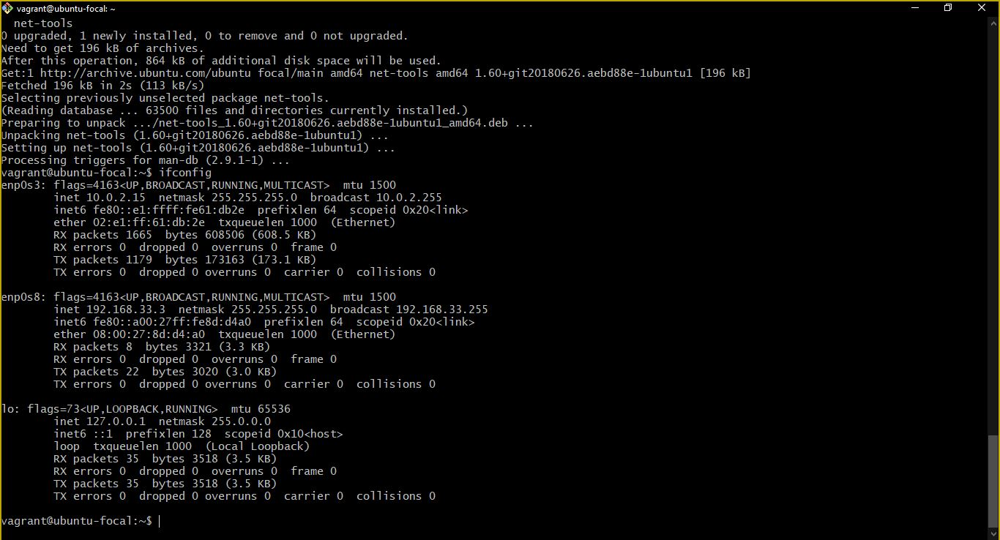

# Altschool-cloud-exercise
A submission of all the exercises on cloud engineering fo rsecond semester

# Altschool-Exercises
A compilation of all Altschool exercises

# Wlecome to my Altschool Exercises
### below are the outputs of my solutions

## Exercise 1

1.  This is the out put of ifconfig after configuring "dhcp"

2. This is the out put of  "/etc/passwd"

3. This is the out put of  "/etc/group"

## Exercise 2 
## 10 Most Commonly Used Linux Commands

1. Concatenate, or cat, is one of the most frequently used Linux commands. It lists, combines, and writes file content to the standard output. To run the cat command, type cat followed by the file name and its extension. For instance:

_cat script.sh_

2. The cd command is used to change the current directory. To run the cd command, type cd followed by the directory name. For instance:
    
_/home/vagrant/memory_logs_

3. The chmod command is used to change the permissions of a file or directory. To run the chmod command, type chmod followed by the permission code and the file name. For instance:
    
_chmod email.sh -x_

4. The chown command is used to change the owner of a file or directory. To run the chown command, type chown followed by the new owner and the file name. For instance:  

_chown vagrant email.sh_
   

5. The cp command is used to copy files and directories. To run the cp command, type cp followed by the file name and its extension, and the destination directory. For instance:    
   
_cp log_file.log logs_

6. The date command is used to display the current date and time. To run the date command, type date. For instance:         
_date_
     

7. The df command is used to display the amount of disk space available on the file system. To run the df command, type df. For instance:                   
_df_
 

8. The du command is used to display the amount of disk space used by a file or directory. To run the du command, type du followed by the file name and its extension. For instance:

_du log_file.log_
                        

9. The echo command is used to display a line of text. To run the echo command, type echo followed by the text. For instance:          

_echo"Hostinger Tutorials"_
        

10. The whoami command is used to display the current user. To run the whoami command, type whoami. For instance:          

_whoami_

## Exercise 3
### 1. Create 3 groups – admin, support & engineering and add the admin group to sudoers
_Groups created_
 

### 2. Generate SSH keys for the user in the admin group

_SSH keys generated_

### 3. contents of /etc/passwd,

### 4. contents of /etc/group

### 5. contents of /etc/sudoers

## Exercise 4
Install PHP 7.4 on your local linux machine using the ppa:ondrej/php package repo.

### 1. Content of php -v command

### 2. content of /etc/apt/sources.list 

##  Exercise 6
### Submit the output of:

### 1. git config -l

### 2. git remote -v
